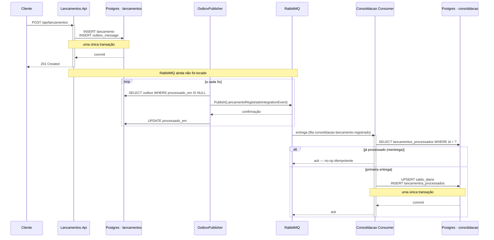
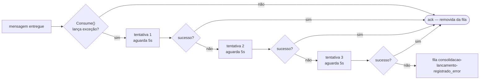

# Lançamentos Financeiros — Fluxo de Caixa e Consolidado Diário

> Sistema de gestão de lançamentos financeiros (créditos e débitos) com consolidação diária de saldo, construído como dois serviços independentes conectados por mensageria, em .NET 8, Clean Architecture, DDD e CQRS.

---

## O problema e a decisão arquitetural central

Um lojista precisa registrar lançamentos de caixa no dia a dia e consultar o saldo consolidado diário. Os requisitos não-funcionais do desafio são explícitos:

- **O serviço de lançamentos precisa continuar operante mesmo se o serviço de consolidação falhar.**
- **O serviço de consolidação processa até 50 chamadas/segundo em pico, tolerando perder até 5% delas.**

Esses dois requisitos, juntos, descrevem dois sistemas com necessidades de disponibilidade e consistência diferentes — não um único serviço. Por isso, esta solução é composta por **dois serviços .NET independentes**, cada um com seu próprio banco de dados, ligados de forma assíncrona por **RabbitMQ**:

```
┌──────────────────────────────┐         RabbitMQ         ┌──────────────────────────────┐
│      Lancamentos.Api         │   (topic exchange)        │      Consolidacao.Api         │
│  Clean Architecture:         │  lancamento.registrado     │  Clean Architecture:          │
│  Domain/Application/         │ ─────────────────────────▶ │  Domain/Application/          │
│  Infrastructure/Api          │                            │  Infrastructure/Api           │
│                               │                            │  (também hospeda o consumer   │
│  POST /api/lancamentos       │                            │   MassTransit em background)  │
│  GET  /api/lancamentos       │                            │                                │
│  GET  /api/lancamentos/{id}  │                            │  GET /api/saldos-diarios      │
│                               │                            │  GET /api/saldos-diarios/{d}  │
│  Postgres: lancamentos       │                            │  Postgres: consolidacao        │
└──────────────────────────────┘                            └──────────────────────────────┘
```

A camada de mensagem compartilhada entre os dois serviços é um único projeto neutro, `Shared.Contracts`, contendo apenas o formato do evento de integração (`LancamentoRegistradoIntegrationEvent`) — nenhuma lógica de negócio é compartilhada, só o contrato de comunicação. Cada serviço mantém seu próprio modelo de domínio, sua própria linguagem ubíqua e seu próprio banco.

### Como a resiliência foi resolvida na prática

**Lançamentos nunca depende do RabbitMQ para aceitar uma escrita.** O `POST /api/lancamentos` grava o `Lancamento` e uma mensagem na tabela `outbox_messages` na **mesma transação local** (padrão Transactional Outbox). Um `BackgroundService` separado (`OutboxPublisher`) lê essa tabela a cada poucos segundos e publica no RabbitMQ; se o broker estiver fora do ar, ele só continua tentando no próximo ciclo — a API nunca é afetada. Isso foi validado manualmente: com o container do RabbitMQ parado, `POST /api/lancamentos` continua retornando `201` normalmente, e o backlog é drenado automaticamente assim que o broker volta.

**Consolidação usa um consumidor idempotente com retry limitado.** O RabbitMQ garante entrega *at-least-once* — então, antes de aplicar um lançamento ao saldo do dia, o consumidor verifica se aquele `LancamentoId` já foi processado (tabela `lancamentos_processados`), evitando contagem duplicada em caso de reentrega. Mensagens que falham repetidamente vão para a fila de erro (`_error`) do MassTransit após um número limitado de tentativas, em vez de retry infinito — essa é a decisão concreta por trás de "tolerar até 5% de perda em pico": o sistema prioriza continuar processando o fluxo saudável em vez de travar tentando reprocessar indefinidamente o que está falhando.

---

## Tecnologias

| Camada | Tecnologia | Versão |
|--------|-----------|--------|
| Runtime | .NET / C# | 8.0 / 12 |
| API | ASP.NET Core (Controllers) | 8.0 |
| ORM | Entity Framework Core + Npgsql | 8.0.10 |
| Banco de dados | PostgreSQL | 16 |
| Migrations | DbUp | 5.0.37 |
| Mensageria | MassTransit + RabbitMQ | 8.5.10 |
| CQRS / Mediator | MediatR | 12.4.1 |
| Validação | FluentValidation | 11.11.0 |
| Documentação da API | Swashbuckle (Swagger/OpenAPI) | 6.9.0 |
| Testes unitários | xUnit + FluentAssertions + Bogus | — |
| Mocking | NSubstitute | 5.1.0 |
| Testes de integração | Testcontainers (PostgreSql + RabbitMq) + WebApplicationFactory | 3.10.0 / 8.0.0 |

---

## Arquitetura interna de cada serviço

Ambos os serviços seguem o mesmo padrão de Clean Architecture + DDD + CQRS:

```
┌────────────────────────────────────────────────────────┐
│  <Serviço>.Api          Controllers, Swagger,           │
│                         ExceptionHandlingMiddleware      │
└──────────────────────────┬───────────────────────────────┘
                           │ ISender.Send(command/query)
┌──────────────────────────▼───────────────────────────────┐
│  <Serviço>.Application  Commands / Queries / Handlers /   │
│                         Validators / Behaviors (MediatR)  │
└──────────────────────────┬───────────────────────────────┘
             ┌──────────────┼──────────────┐
             ▼                             ▼
┌──────────────────────┐      ┌──────────────────────────┐
│  <Serviço>.Domain     │      │  <Serviço>.Infrastructure │
│  (Entidades, Erros,   │      │  (EF Core, Repositórios,  │
│   Repositórios-contrato)│    │   MassTransit)             │
└──────────────────────┘      └──────────────────────────┘
```

**Fluxo de uma requisição:** `HTTP → Controller → MediatR → LoggingBehavior → ValidationBehavior → Handler → Repository → EF Core → PostgreSQL`

Não há camada MVC/Web — o desafio pede um sistema funcional com boa arquitetura, não uma interface gráfica; as APIs REST + Swagger cobrem a necessidade de demonstração e uso.

---

## Diagramas

### Ciclo de vida de um lançamento — do `POST` ao saldo consolidado



A escrita (`POST` → `201`) nunca espera o RabbitMQ — o outbox garante que a mensagem seja publicada eventualmente, mesmo que o broker esteja fora do ar no momento do registro (ver seção de resiliência acima).

### Quando o consumidor falha — retry limitado, depois fila de erro



---

## Como executar

### Pré-requisito

- [Docker Desktop](https://www.docker.com/products/docker-desktop/)

### Um único comando

```bash
docker compose up --build
```

Isso sobe, na ordem correta:

1. **PostgreSQL** (um container, dois databases: `lancamentos` e `consolidacao`) — aguarda ficar saudável
2. **RabbitMQ** — com painel de management
3. **Migrations** de cada serviço — aplicam os scripts SQL e encerram
4. **Lancamentos.Api** e **Consolidacao.Api** — sobem após suas respectivas migrations concluírem

### URLs após a inicialização

| Serviço | URL |
|---------|-----|
| Lançamentos API | `http://localhost:5127` |
| Lançamentos Swagger | `http://localhost:5127/swagger` |
| Consolidação API | `http://localhost:5227` |
| Consolidação Swagger | `http://localhost:5227/swagger` |
| RabbitMQ Management | `http://localhost:15672` (guest/guest) |

### Testando o fluxo manualmente

```bash
# Registrar um crédito
curl -X POST http://localhost:5127/api/lancamentos \
  -H "Content-Type: application/json" \
  -d '{"data":"2026-08-09","tipo":"Credito","valor":1000.00,"descricao":"Venda de produto"}'

# Consultar o saldo consolidado do dia (após alguns segundos, tempo do outbox publicar + consumer processar)
curl http://localhost:5227/api/saldos-diarios/2026-08-09
```

### Verificando a resiliência

```bash
# Derruba o RabbitMQ
docker compose stop rabbitmq

# A API de lançamentos continua aceitando escritas normalmente (201)
curl -X POST http://localhost:5127/api/lancamentos \
  -H "Content-Type: application/json" \
  -d '{"data":"2026-08-09","tipo":"Debito","valor":50.00,"descricao":"Teste com broker fora do ar"}'

# Sobe o RabbitMQ de novo — o backlog do outbox é drenado automaticamente
docker compose start rabbitmq
```

### Parar o ambiente

```bash
docker compose down       # mantém os dados
docker compose down -v    # remove também os volumes do banco
```

---

## Como rodar os testes

### Pré-requisito para testes de integração

Requerem **Docker em execução** — o Testcontainers sobe PostgreSQL e RabbitMQ automaticamente durante a execução.

### Executar todas as suítes

```bash
dotnet test
```

### Por suíte

```bash
# Domínio — sem infra, sem mocks
dotnet test tests/Lancamentos.Domain.Tests
dotnet test tests/Consolidacao.Domain.Tests

# Application — handlers e validators com mocks NSubstitute
dotnet test tests/Lancamentos.Application.Tests
dotnet test tests/Consolidacao.Application.Tests

# Integração — API real + PostgreSQL + RabbitMQ reais em containers
dotnet test tests/Lancamentos.Integration.Tests
dotnet test tests/Consolidacao.Integration.Tests
```

### Resultado esperado

| Suíte | Testes | Tipo |
|-------|--------|------|
| `Lancamentos.Domain.Tests` | 9 | Unitários — sem mocks, sem banco |
| `Lancamentos.Application.Tests` | 22 | Unitários — mocks de repositório |
| `Lancamentos.Integration.Tests` | 5 | E2E — API + PostgreSQL + RabbitMQ reais (Testcontainers) |
| `Consolidacao.Domain.Tests` | 6 | Unitários — sem mocks, sem banco |
| `Consolidacao.Application.Tests` | 14 | Unitários — mocks de repositório, incluindo teste de idempotência |
| `Consolidacao.Integration.Tests` | 3 | E2E — publica evento real no RabbitMQ e valida o consumo assíncrono |
| **Total** | **59** | |

---

## Endpoints

### Lançamentos — `http://localhost:5127/api`

| Método | Rota | Caso de uso | Retornos possíveis |
|--------|------|-------------|--------------------|
| `POST` | `/lancamentos` | Registrar lançamento (crédito ou débito) | `201` / `400` / `422` |
| `GET` | `/lancamentos` | Listar lançamentos (filtros + paginação) | `200` / `400` |
| `GET` | `/lancamentos/{id}` | Buscar lançamento por Id | `200` / `404` |

**Filtros em `GET /lancamentos`:** `data`, `tipo` (`Credito`/`Debito`), `pagina`, `tamanhoPagina`.

**Payload de exemplo:**
```json
POST /api/lancamentos
{
  "data": "2026-08-09",
  "tipo": "Credito",
  "valor": 1500.00,
  "descricao": "Venda de mercadoria"
}
```

### Consolidação — `http://localhost:5227/api`

| Método | Rota | Caso de uso | Retornos possíveis |
|--------|------|-------------|--------------------|
| `GET` | `/saldos-diarios/{data}` | Saldo consolidado de um dia específico | `200` (zerado se não houver lançamentos) |
| `GET` | `/saldos-diarios?dataInicial=&dataFinal=` | Lista de saldos diários em um período | `200` / `400` |

### Mapeamento de erros HTTP (ambos os serviços)

| HTTP | Situação |
|------|---------|
| `400` | Falha de validação de entrada (FluentValidation) |
| `404` | Recurso não encontrado |
| `422` | Violação de regra de negócio do domínio |
| `500` | Erro interno inesperado |

Todas as respostas de erro seguem `ProblemDetails` (RFC 7807).

---

## Regras de negócio

| Regra | Onde é aplicada |
|-------|------------------|
| Lançamento tem data, tipo (crédito/débito), valor e descrição | `Lancamento.Criar(...)` |
| Valor deve ser maior que zero | Domínio (`Lancamento`) + Validator (defesa em profundidade) |
| Descrição obrigatória, mínimo 3 caracteres | Domínio (`Lancamento`) + Validator |
| Data não pode ser no futuro | Domínio (`Lancamento`) — regra de negócio pura, não é só formato |
| Lançamento é imutável — sem edição ou exclusão | Modelo de domínio (só `Criar`, sem métodos de mutação) |
| Saldo diário = créditos do dia − débitos do dia (não acumulado) | `SaldoDiario.Aplicar(...)` |
| Dia sem lançamentos retorna saldo zerado, não erro | `GetSaldoDiarioHandler` |
| Reentrega do mesmo lançamento não duplica o saldo | `AplicarLancamentoHandler` + tabela `lancamentos_processados` |

---

## Estrutura da Solution

```
LancamentosFinanceiros.slnx
│
├── src/
│   ├── Shared.Contracts/                        # Único projeto compartilhado — contrato do evento de integração
│   │
│   ├── Lancamentos.Domain/                      # Entidade Lancamento, regras de negócio, contrato de repositório
│   ├── Lancamentos.Application/                 # CQRS: RegistrarLancamento, ListLancamentos, GetLancamentoById
│   ├── Lancamentos.Infrastructure/               # EF Core, Outbox + OutboxPublisher, MassTransit (publisher)
│   ├── Lancamentos.Infrastructure.Migrations/    # DbUp + scripts SQL (0001–0004)
│   ├── Lancamentos.Api/                          # Controllers, Middleware, Swagger
│   │
│   ├── Consolidacao.Domain/                      # Entidade SaldoDiario, regras de negócio, contrato de repositório
│   ├── Consolidacao.Application/                 # CQRS: AplicarLancamento, GetSaldoDiario, ListSaldosDiarios
│   ├── Consolidacao.Infrastructure/               # EF Core, consumer MassTransit, idempotência
│   ├── Consolidacao.Infrastructure.Migrations/    # DbUp + scripts SQL (0001–0003)
│   └── Consolidacao.Api/                          # Controllers, Middleware, Swagger, host do consumer
│
├── tests/
│   ├── Lancamentos.Domain.Tests/
│   ├── Lancamentos.Application.Tests/
│   ├── Lancamentos.Integration.Tests/
│   ├── Consolidacao.Domain.Tests/
│   ├── Consolidacao.Application.Tests/
│   └── Consolidacao.Integration.Tests/
│
├── scripts/postgres-init/                        # Cria os dois databases lógicos na subida do container
├── docs/                                         # Documentação técnica aprofundada por camada
│   ├── decisoes-arquiteturais.md                 # Padrões, mensageria/resiliência, bibliotecas (cross-service)
│   ├── masstransit-por-dentro.md                 # Topologia real do RabbitMQ (exchanges/filas/bindings verificados ao vivo)
│   ├── Lancamentos/                               # dominio, application, infrastructure, api, migrations, testes
│   └── Consolidacao/                              # dominio, application, infrastructure, api, migrations, testes
└── docker-compose.yml
```

> A documentação de cada camada segue o mesmo padrão do template de referência usado neste projeto: o que é, onde está implementado, e por que foi escolhido — incluindo o raciocínio por trás de decisões específicas deste sistema (Outbox, Idempotent Consumer, retry/fila de erro).

---

## Premissas adotadas

| Premissa | Justificativa |
|----------|---------------|
| Dois serviços separados em vez de um monólito | Os NFRs pedem explicitamente domínios de falha independentes — um monólito não demonstraria isso de forma real |
| PostgreSQL no lugar de outro banco relacional | Gratuito, suporte nativo via Npgsql, amplamente usado em produção |
| Um container Postgres com dois databases lógicos | Isolamento real de dados (zero tabelas compartilhadas) com footprint mais leve para rodar localmente |
| MassTransit como abstração sobre RabbitMQ | Retry policies e fila de erro automática prontos, em vez de reimplementar isso sobre `RabbitMQ.Client` puro |
| Outbox e idempotência como tabelas DbUp (não o outbox nativo do MassTransit) | Mantém uma única estratégia de migração (DbUp) no sistema inteiro; evita depender de um schema de terceiro não revisável no código |
| Lançamento imutável (sem update/delete) | Reflete a semântica real de um livro-caixa/ledger — erros se corrigem com lançamento de estorno, nunca editando o passado |
| Saldo diário não acumulado | É literalmente o que o enunciado pede ("saldo consolidado diariamente"); saldo acumulado pode ser derivado somando os dias, se necessário |
| Sem camada MVC/Web | Não solicitado; Swagger já cobre a necessidade de demonstração interativa |
| Consumer hospedado no mesmo processo da API de Consolidação | Simplificação razoável para o escopo do desafio — ver "Melhorias futuras" para separação em worker próprio |

---

## Decisões técnicas

| Decisão | Alternativa considerada | Motivo da escolha |
|---------|-------------------------|---------------------|
| Transactional Outbox homemade (tabela + `BackgroundService`) | `AddEntityFrameworkOutbox` nativo do MassTransit | Controle total do schema via DbUp, sem misturar duas ferramentas de migração no mesmo banco |
| Consumidor idempotente via tabela de deduplicação | Confiar em exactly-once do broker | RabbitMQ garante só at-least-once; a idempotência precisa ser responsabilidade da aplicação |
| Retry limitado + fila de erro automática do MassTransit | Retry infinito | Um consumidor tentando reprocessar uma mensagem "envenenada" para sempre derruba a vazão do sistema sob carga — é isso que fundamenta a tolerância a perda de até 5% |
| `Shared.Contracts` como único projeto compartilhado entre os serviços | Duplicar o contrato em cada serviço | Contratos de mensagem são a interface pública entre serviços — compartilhar só a forma da mensagem (sem lógica) é prática padrão em sistemas orientados a mensageria |
| MediatR como despachante CQRS (ambos os serviços) | Injeção direta de handlers | Pipeline de behaviors (Validation, Logging) desacoplado; o mesmo padrão serve tanto para requisições HTTP quanto para o consumer de mensageria |
| `DateOnly` para a data do lançamento e do saldo | `DateTime` | Consolidação é estritamente por dia — `DateOnly` expressa isso no próprio tipo, sem risco de comparação por horário |
| Testcontainers com RabbitMQ real nos testes de integração | Mock do broker ou MassTransit Test Harness em memória | Testa a configuração real de exchange/fila/retry, não uma simulação — validou inclusive o cenário de idempotência com mensagem duplicada de verdade |
| `ExceptionHandlingMiddleware` centralizado (replicado nos dois serviços) | `try/catch` por controller | Um único ponto de mapeamento de exceção → HTTP; controllers ficam limpos |

---

## Melhorias futuras

| Melhoria | Prioridade | Descrição |
|----------|-----------|-----------|
| Job de reconciliação periódica | Alta | `HostedService` na Consolidação que recalcula o saldo do dia consultando a API de Lançamentos periodicamente, como rede de segurança contra mensagens perdidas na fila de erro. Avaliado durante o design e conscientemente adiado para manter o escopo do desafio controlado. |
| Separar o consumer em um worker próprio | Média | Hoje o consumer roda no mesmo processo da API de consulta da Consolidação; separar permite escalar consumo e consulta de forma independente |
| Autenticação e autorização | Média | JWT Bearer, controle de acesso por papel |
| Idempotency-Key no `POST /lancamentos` | Média | Protege contra duplicação de lançamentos por retry de rede do lado do cliente, complementando a idempotência já existente do lado da mensageria |
| Observabilidade | Baixa | OpenTelemetry (traces distribuídos entre os dois serviços) + Serilog estruturado |
| Saldo acumulado como visão derivada | Baixa | Endpoint adicional que soma os saldos diários de um período, sem alterar o modelo de saldo por dia |
| Concorrência otimista | Baixa | `xmin` do PostgreSQL como `RowVersion` no EF Core |
| Rate limiting | Baixa | `Microsoft.AspNetCore.RateLimiting` na API de Lançamentos |

---

## Checklist de aderência ao desafio

- [x] Construído em C# / .NET 8
- [x] Rotinas de testes automatizados (59 testes: domínio, application e integração)
- [x] Clean Code, SOLID e Design Patterns (Repository, Factory Method, Guard Clause, Result Pattern, Mediator, Pipeline, Outbox, Idempotent Consumer)
- [x] README com passos detalhados, pré-requisitos e modo de funcionamento
- [x] Desenho da solução (diagramas ASCII neste README)
- [x] Processamento assíncrono via mensageria (RabbitMQ + MassTransit)
- [x] Containers (Docker Compose orquestrando Postgres, RabbitMQ e os quatro serviços .NET)
- [x] Lançamentos permanece operante mesmo com falha na Consolidação (validado manualmente e documentado acima)
- [x] Consolidação resiliente a picos de carga via retry limitado + fila de erro
